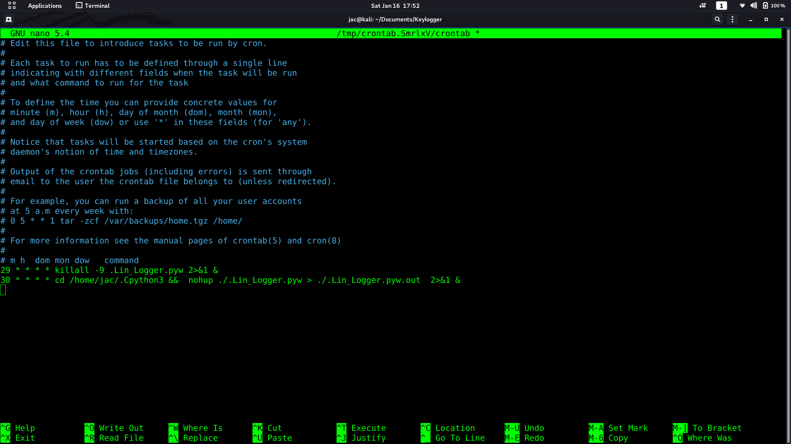

# Keylogger

* a computer program that records every keystroke made by a computer user, especially in order to gain fraudulent access to passwords and other confidential information. 
* keylogger use pynput 
* written by python 3.7
* No installation  required  
* keylogger will check in machine have install pynput if not will install it in background silent mode 

## features:-

* handle the backspace key
* handle the Caps Lock key
* run in background
* run in root privilege and non-root privilege
* send email attached log file 

## more features :-

* grep public IP
* grep local IP
* grep user name
* grep host name
* grep ssid '3 interface'
* if run as root will grep WiFi password 

## background process

* keylogger will add the new  two entry at crontab scheduling 
* by default will run after 30 mints and will kill the process ever 29 min  
* to change the time set in script your tins as the pic 
### NOTE::=
* the script not run as @reboot so do not set the crontab at @reboot you will git error X server not running
* if set time every hour the keylogger will run at the time you set  
* the script use Display environment to work in background by default Display environment set to loop  0 or 1 

  

## how to use:-

* git clone https://www.github.com/jac11/Keylogger_linux.git
* copy the file USB or what ever mouthed you like and run the keylogger in terminal one time use 'python3 Lin_keylogger.py'
* if run in root account keylogger will copy itself to /etc/.Cpython3/.Lin_keylogger.pyw 
* if user account keylogger will copy itself to /home/'user name'/.Cpython3/.Lin_keylogger.pyw
* keylogger will add the  two entry at crontab scheduling  one to start process and one for kill the process scheduling between both 

## send email :-

* keylogger will send email to your Gmail account 
* encode your email and password bes64 and add to the  variable see the pic down blow 
* keylogger  will do  auto decode bes64 then will send email
*  set the timer for email by second so if you set after 1 min set 60 second

  

## log file :-

  

## Language support :-
* the code by default encoder is UTF-8 
* English language 
* UTF-8 support Unicode so can work fine with other language 

## connect me :-
* administrator@jacstory.tech
*thank you 
